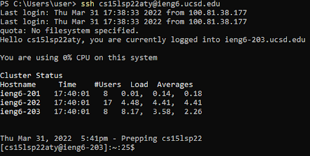
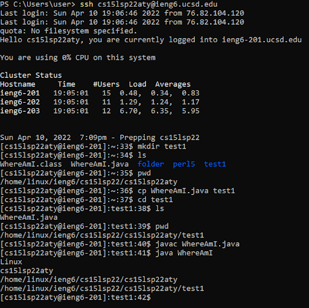
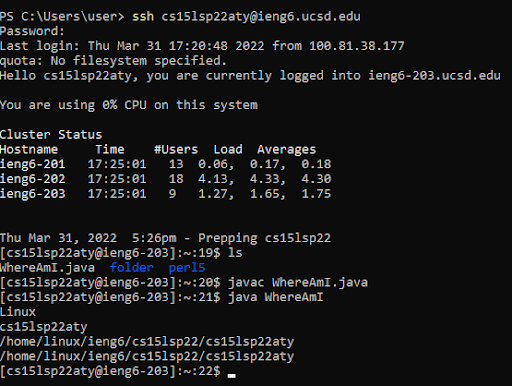
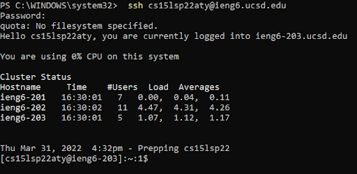
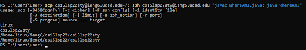

# Lab Report 1 Week 2 

## Installing Vscode

> In order to install VSCode, simply go to [the VSCode website](https://code.visualstudio.com/Download) 
> and follow the instructions. This is how the Visual Studio Code menu looks like:

.png)

---

## Remotely Connecting

> Do the ssh command with the following format:
```
ssh cs15lsp22zz@ieng6.ucsd.edu
```
> In general, the text before the '@' is the user while the text after the '@' is the host server. 
Then, you will be prompted to enter a password. You may need to find your password or create a new one. 
[Here is where you can look up your UCSD account](https://sdacs.ucsd.edu/~icc/index.php). After 
successfully logging in, your screen may look like this:



---

## Trying Some Commands

**cd**

> This command changes the current directory, or folder, to the one named after the command.

**ls**

> This command shows the contents of the current directory.

**pwd**


> This command prints the path of the current directory.


**mkdir**


> This command makes a new directory.


**cp**


> This command copies a file or folder.

---

> In order to properly test these methods, I will be using a file called WhereAmI.java which reveals
the location of the file location. This is the code for the program:

```
class WhereAmI {
    public static void main(String[] args) {
    System.out.println(System.getProperty("os.name"));
    System.out.println(System.getProperty("user.name"));
    System.out.println(System.getProperty("user.home"));
    System.out.println(System.getProperty("user.dir"));
}
}
```


> This screenshot showcases the different commands in action. What I did is:
> 1. logged into host server
> 2. made a new folder called test1
> 3. showed the contents in the current directory
> 4. printed path of the working directory
> 5. copied the file WhereAmI.java to the folder test1
> 6. changed the current directory to test1
> 7. printed the contents in test1
> 8. printed the path of test1
> 9. ran the WhereAmI program



---

## Moving Files with scp

> The scp command sends a copy of a file from the first user to the second user. You will first need 
to be logged into the account of the first user. The following screenshot shows logging in to the host 
server and running the WhereAmI program to show that the file has been copied and sent to the host server.



---

## Setting an SSH Key

> Enabling this feature allows you to not have to enter in a password every time you log into the host
server using the ssh command. Setting up an SSH key is quite complicated so refer to [the Lab 1 write up](images/Lab_1.pdf) 
for this, starting on page 9.

>  As shown here, logging in using the ssh command no longer requires a password:



---

## Optimizing Remote Running

> Special techniques can be used in order to make remote running faster, through reducing the number of clicks or 
the runtime. For example, you can use semicolons to run multiple commands at once. You can also use quotations in 
order to run commands on a host server immediately after connecting to it. The following screenshot shows 
sending WhereAmI.java to the host server, logging in to the host server, and running the WhereAmI program all in 
one command.


