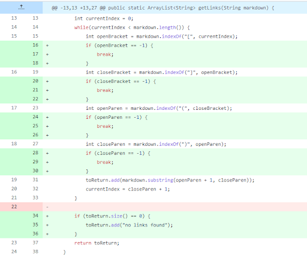
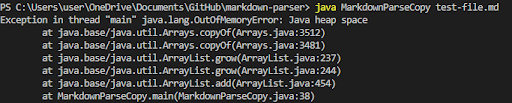
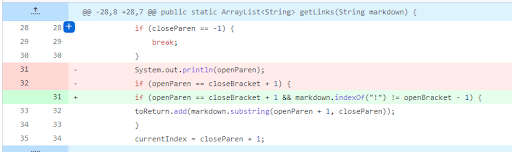
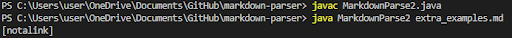
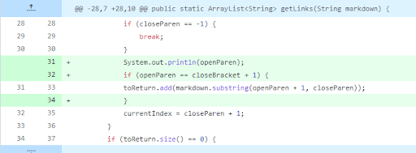
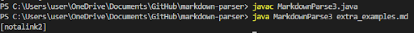

# Lab Report 2 Week 4 

## Commit 1

> [link to commit 1](https://github.com/jwyamaguchi/markdown-parser/commit/8e9505d484fc3457412416af77b356906dff8ebe)

> [failure-inducing input](images/test-file.md)

**Symptom of input:**

> If there are any characters after the link, then the program will endlessly loop, causing the program to throw the OutOfMemoryError. This also includes if any of the elements of the link are missing, such as the brackets and parentheses. So, I fixed the program to break out of the while loop if any of the elements are missing, thus signalling that there are no more links to be added.

---

## Commit 2

> [link to commit 2](https://github.com/jwyamaguchi/markdown-parser/commit/0cf5acbc831e463479762cac010b969fa4fe82eb)

> [failure-inducing input](images/extra_examples.md)

**Symptom of input:**

> The program counted image links as regular links. This is because the code only checks for brackets and parentheses, but doesn't account for any additions that may differentiate the text from a link. So, I changed the code so that images would no longer be included by checking if there is an "!" before the link before adding it to the output.

---

## Commit 3

> [link to commit 3](https://github.com/jwyamaguchi/markdown-parser/commit/75662a13097ddb4cca9effa441389d0c1b738d86)

> [failure-inducing input](images/extra_examples.md)

**Symptom of input:**

> The program specifically checks for brackets and parentheses, and makes sure they are in the right order, but doesn't check if they are in the right format. One example of incorrect formatting is if the closed bracket isn't next to the open parenthesis. So, I changed the code so that the open parenthesis must be immediately after the closed bracket in order to be added to the output.