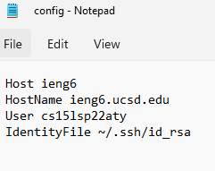
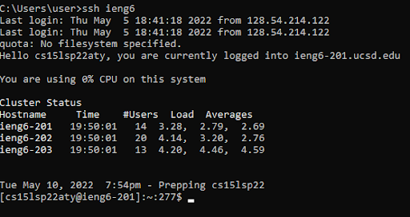
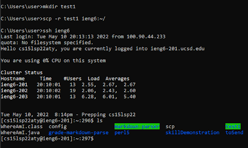
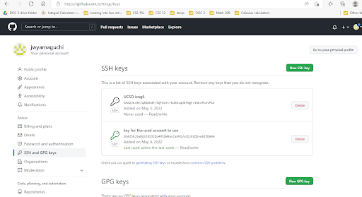
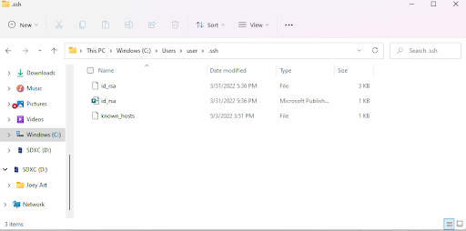
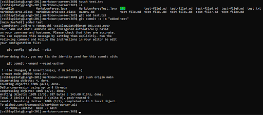
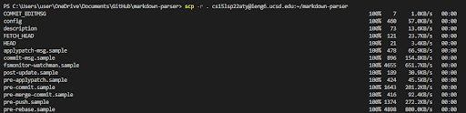
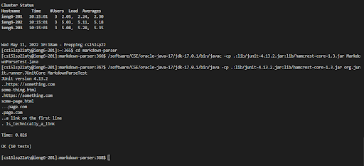
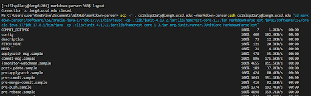
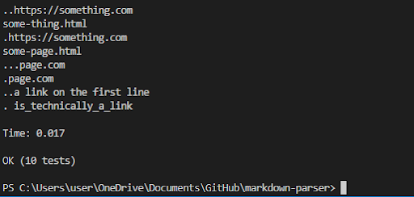

# Lab Report 3 Week 6 

## Streamlining ssh Configuration

> This is the ssh config file for the school remote server:



> in order to create one, you can type this command into the command prompt:

```
 notepad file_name
```

> Once you have it set up, you will be able to sign in with just ssh and your username like this:



> The following image demonstrates, creating a new test directory, sending it using just the username, logging in with just the username, and then listing the files.



---

## Setup GitHub Access from ieng6

> Here are where the public ssh key is stored in GitHub and in my user account. The second image also shows where the private key is stored.







> With it set up, the following image demonstrates creating a new test file on the remote server, showing the directory, and then committing and pushing the new file.

> [this is the link to the resulting commit.](https://github.com/jwyamaguchi/markdown-parser/commit/3aefe5114b09b975f0ebab9bfb380dc7ae354e54)

---

## Copy Whole Directories with scp -r

> As the header states, you can copy the directory and everything in it using:

```
scp -r
```

> The following shows copying the markdown-parse directory to the remote server, logging, and compiling and running the tests.





> This can also be done all in a single line of command, like so:



