# Lab Report 4 Week 8 
> [This is the link to my markdown-parser repository.](https://github.com/jwyamaguchi/markdown-parser) 

> [This is the link to the markdown-parser repository that our group reviewed in Lab 7.](https://github.com/fnriv/markdown-parser) 

## Snippet 1

> Opening preview by right clicking the file will allow us to see which of the links are valid links. Hovering the cursor over the real links highlighted in blue reveals its related link.

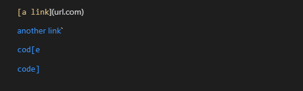

> This is the test written in the MarkdownParseTest file. It compares the links ArrayList with a test ArrayList with the links that it is supposed to contain that are valid links according to the above test.

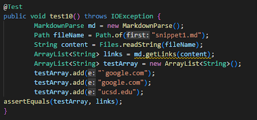

> For my implementation of MarkdownParse, the test failed.

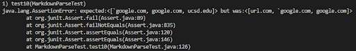

> It also failed for the implementation our group reviewed for Lab 7.

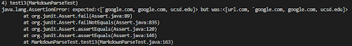

> In order to make my program work for all cases that uses inline code with backticks, I believe that the change will be more involved and be longer than 10 lines. My first instinct would be to use a stack ADT that would insert elements such as brackets and parentheses, pop when the matching element is found, and skip to the next link if a mismatch occurs, however the case is different for the parentheses where backticks could be placed both inside and outside the parenthesis pair and it would still count as a link.

> For the links my program was able to successfully able to detect, my program to the very least had the basic functionality of detecting the brackets and parentheses and returning the text within the parentheses.

---

## Snippet 2

> Opening preview by right clicking the file will allow us to see which of the links are valid links. Hovering the cursor over the real links highlighted in blue reveals its related link.

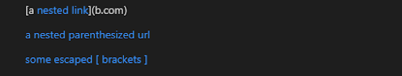

> This is the test written in the MarkdownParseTest file. It compares the links ArrayList with a test ArrayList with the links that it is supposed to contain that are valid links according to the above test.

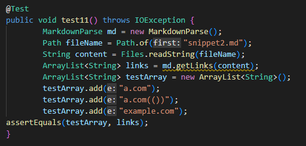

> For my implementation of MarkdownParse, the test failed.

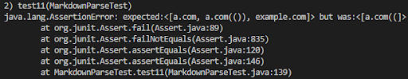

> It also failed for the implementation our group reviewed for Lab 7.

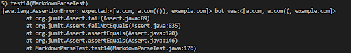

> In order to make my program work for all cases with nested brackets and parentheses, I believe that this change will also be more involved and be longer than 10 lines. In order to make each of the cases work, it would need to prioritize the innermost nested link for the case of nested links, as well as use a stack to make sure that each element is matching up correctly for the case of nested brackets and parentheses.

---

## Snippet 3

> Opening preview by right clicking the file will allow us to see which of the links are valid links. Hovering the cursor over the real links highlighted in blue reveals its related link.

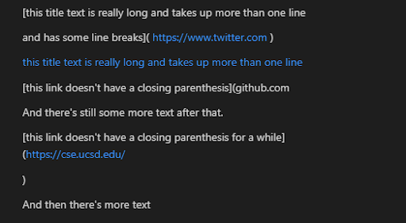

> This is the test written in the MarkdownParseTest file. It compares the links ArrayList with a test ArrayList with the links that it is supposed to contain that are valid links according to the above test.

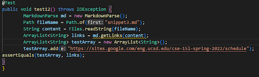

> For my implementation of MarkdownParse, the test failed.

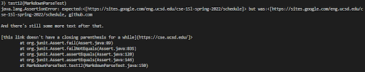

> It also failed for the implementation our group reviewed for Lab 7.

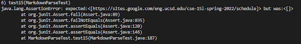

> In order to make my program work for all cases with newlines in brackets and parentheses, I again believe that this change will be more involved and be longer than 10 lines. In order to make each of the cases work, it would need to again prioritize inner links in order to avoid cases errors with missing close parentheses. It would also need to be so that newlines are valid inside of brackets and invalid inside parentheses.

> My program worked for one of the cases as it seems that the default is to accept code with inner newlines.