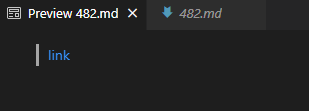

# Lab Report 5 Week 10


> This is an example of some of the test runs that gave contradictory output. I found these results by using the vimdiff command on two results files. This is the command:

``` 
vimdiff markdown-parser/results.txt cse15lsp22-markdown-parser/results.txt
```

> I got these results files by using the following commands:

```
$ make test
$ bash script.sh > results.txt
```
> [link to test 482](https://github.com/jwyamaguchi/markdown-parser/blob/main/test-files/482.md) 

> [link to test 483](https://github.com/jwyamaguchi/markdown-parser/blob/main/test-files/483.md) 

> This is what is produced by the VSCode preview for test 482:



> The expected link is /uri, meaning that the cse15lsp22-markdown-parser implementation was correct.

> This is what is produced by the VSCode preview for test 483:


> The image is empty as no text was provided for the text the link is supposed to be embedded in, but the expected link for the output is ./target.md, meaning that the cse15lsp22-markdown-parser implementation was correct.


> I found out the reason why neither cases worked for the markdown-parser implementation. It's because in the code above, there are several if statements in order to prove the validity of the link before adding it to the output. Among the if statements is one used to check if there is an exclamation mark right before the open parenthesis, and if there is, excluding it as those are images rather than links. The code does this by checking if the exclamation mark index is equal to the open parenthesis minus one. However, if the link starts at the very beginning, the index for exclamation mark will be -1 as it doesn't exist, while the index for open parenthesis will be 0 as it is the very first character, meaning that all cases of the link starting at the beginning the file will also fulfill the condition of being excluded from the link output.